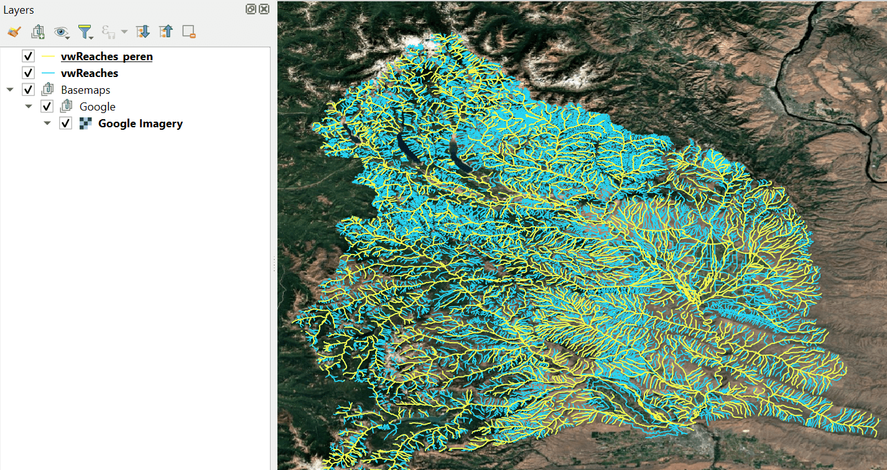
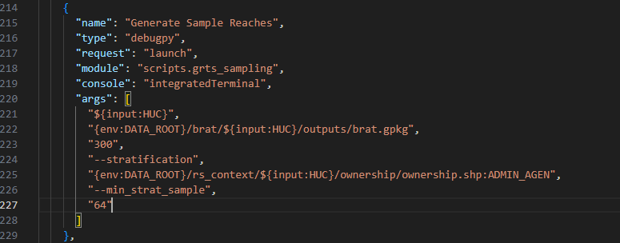
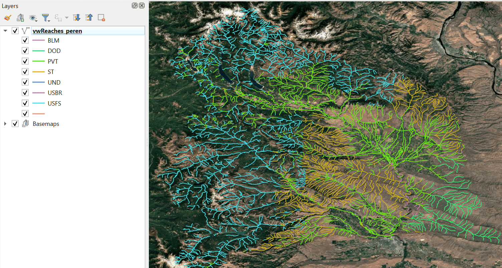

# Generate GRTS Sample Reaches for BRAT Field Data Collection

As part of our PNW BRAT project (A), we are producing sample reaches for various partners to use to collect data using the 
Beaver Resource and Activity Survey (Survey123) form. The idea is that the reaches are a random sample, but are spatially distributed
acroess the geography. Additionally, the reaches may need to be stratified by other geospatial layers, for example ecoregion or ownership
to ensure that there are enough reaches represented across distinct parts of the landscape. Within the BRAT directory in the 
riversapes-tools repository, there is a script that can be run to generate these sample reaches. Some initial data preparation 
and calculations are required before running the script, which are detailed below.

If reaches are being generated for a spatial extent larger than a single BRAT project, a merged project for the area needs to be generated first. 
Merging projects is a separate process that is not covered here.

## 1. Create a perennial BRAT output network

In the BRAT project folder, the brat.gpkg geopackage in the output folder contains a feature class called vwReaches, which is the line network 
output of BRAT. It contains the whole network, including intermittent and ephemeral. Generally for field sampling we only want to visit perennial 
reaches, so the first step is to create a perennial layer. Select feature with FCodes 46006 and 55800, then export the selection into the same geopackage 
with the name vwReaches_peren.

## 2. Open the riverscapes-tools repository in a GitHub Codespace

If you don't already have a codespace, create a new one by clicking the green `Code` button. Click on the `codespaces` tab, then the three dots 
and select `new with options`.

When the codespace build is finished, it will open VSCode in a browser. You can either work directly in the browser, or close it and reopen 
the codespace in VSCode locally. To do that, return to the `Code>Codespaces` tab. There will now be a named codespace that you created, and 
you can open it by clicking on the three dots next to it and selecting `Open in Visual Studio Code`. This will open a new instance of VSCode, 
connected to your codespace.

If you *do* already have a codespace you want to work in, open that codespace in VSCode. When it is open, make sure you are on the master branch, 
and do a git pull to make sure that it is up to date.

In the VSCode directory (on the left side) navigate to the `Workspaces` folder in the riverscapes-tools repository and open the BRAT.code-workspace 
file. A blue `Open Workspace` button should appear on the screen. Click it to enter the BRAT code workspace.

## 3. Upload the BRAT project you are generating sample reaches for to the codespace's data directory

If you do not already have a data directory for the codespace you're working in, you will need to create one. Pressing `ctrl+j` will open a terminal. 
Typing `mkdir /workspaces/data` will create a directory called data where you can store data. To open this folder to interact with it you can type 
`code /workspaces/data`, which will open a new instance of VSCode in the data directory you just created. From here, you can drag data into the VSCode 
directory as well as right click and download data from your codespace data directory to your local machine. Make sure the 'Explorer' panel is open (on 
the left side of the screen). Right click somewhere and click `New folder...`. Name the new folder `brat`. Then, drag the BRAT project you're generating 
sample reaches for from wherever it is on your local machine into the newly created 'brat' directory.

## 4. Get the information you need to parameterize the script / update the launch.json file

Within the BRAT riverscapes-tools directory there is a folder called `.vscode` with a file called `launch.json` inside. These are the scripts that are set 
up to run via the `run and debug` tab on the left side of the VSCode screen. If you navigate down there is a task called 'Generate Sample Reaches'.

The task has a set of arguments (args), which include:
- input: you will interactively type this in when you run the script.
- brat geopackage path
- number of sample reaches to generate (in the image, 300 reaches are being generated)
- stratification layers - this is a comma separated list of key value pairs where the key is the polygon feature class you want to use to stratify reaches and
the value is the field within that layer to use (in the image the ownership shapefile from riverscapes context is being used based on the field 'ADMIN_AGEN')
- minimum stratification sample - this is the minimum number of reaches each different stratification value should contain, and should be proportional to the 
fraction of BRAT reaches that fall within that polygon. (E.g., in the image 21% of the perennial reach length falls within the smallest ownership category, 
therefore the minimum sample is 21% of 300 reaches - 64; see below)

If you are stratifying by a polygon (e.g., land ownership, ecoregions), you need to figure out what proportion of the reaches fall within the smallest of the 
layer categories to parameterize the last argument in the script. In the image below, the smallest land ownership category (i.e., the one that the least amount 
of reaches fall within is DOD). By summing the length of reaches within DOD ownership (421193 m) and dividing by the total reach length (6668510 m) it is 
determined that 6% of the reach length falls within that smallest category. Therefore I would multiply the total number of reaches I'm producing by 0.06 to 
get the last arg (e.g., if I was generating 300 reaches, I would change the last arg to 19).

Update the launch.json file as necessary to reflect the total number of reaches, stratification layers, and minimum sample number as needed, then save the file.

## 5. Run the script

Click on the `Run and Debug` tab on the left side of the screen. Select the `Generate Sample Reaches` task from the dropdown at the top of the screen, then
click the green play button to run the script. When prompted in the terminal, enter name of the BRAT folder in the data directory (e.g., if the brat project is
at /workspaces/data/brat/some_name you would type `some_name`). The script adds a new geopackage to the BRAT project called 'sample_reaches.gpkg' that will 
contain a feature class for the samples and the buffers associated with the reaches ('samples', 'buffer_100m', buffer_30m).

## 6. Upload (or reupload) the projet to the Data Exchange

After updating the BRAT project to add the sample reaches, it will need uploaded to the data exchange. 
Return to the VSCode instance open to the data directory and use the 
command line to upload the project to the Data Exchange again. 
If the project has previously been in the Data Exchange and just needs updated, click `ctrl+j` to open a terminal and enter 
`rscli upload /workspaces/data/brat/<folder_name> --tags <any existing tags>,grts_samples`, and press enter. Project tags are overridden, 
so make sure you type in any tags that the BRAT project already had (e.g., 2025CONUS) in addition to the grts_samples to add that as a 
tag for identification. You'll be authenticated and will confirm you want to upload the project.
If the project has NOT previously been uploaded to the Data Exchange (e.g., if it's a new merged project), then click `ctrl+j` and enter 
`rscli upload /workspaces/data/brat/<folder_name> --org <ORG GUID> --tags <any tags you want to add>,grts_samples`, and press enter. In this case 
you are assigning the project to an organization (ORG GUID) for the first time, so you need to include that argument. You will be authenticated and
will confirm you want to upload the project.