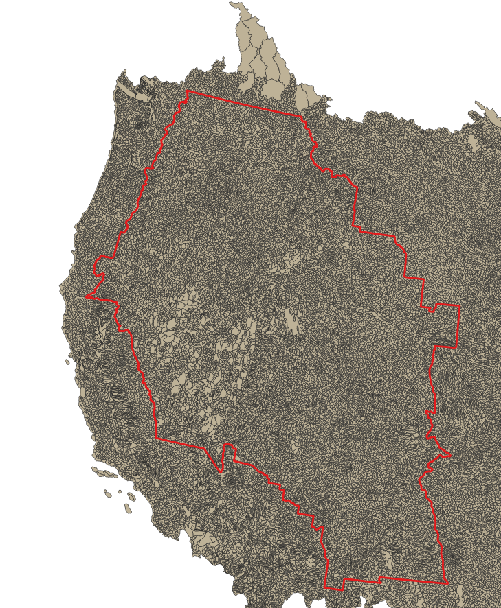

# Inter-Mountain West Analysis
Philip Bailey

24 Sep 2019

The scripts in this folder were written to support an inquiry from Joe Wheaton on
as to how many miles of perennial channel are there in the inter-mountain west.
I thought that this would be an interesting exercise to test whether some of the housekeeping tools
written for BRAT could be useful for such inquiries.

## 1. Inter-Mountain West

I downloaded a polygon ShapeFile that defined the [extent of the inter-mountain west](https://iwjv.org/resource/intermountain-west-joint-venture-boundary-map).

## 2. Identifying 4-digit HUCs.

I loaded the inter-mountain west polygon into QGIS along with the national map of 12-digit HUCs
that I downloaded from the USGS Science Base Catalog.

I used a simple "select by location" to select all 12 digit HUCs that intersected with the inter-mountain 
west extent.

I then exported the selected 12-digit HUC features to a new ShapeFile and ran the
`identify_huc.py` script to export the 4-digit HUC identifiers to a CSV file.

It turns out that there are 59 unique 4 digit HUCs in the inter-mountain west.

## Download NHD

I fed the list of 4 digit HUCs into the `download_huc.py` script to download all available the [NHD Plus HR](https://www.usgs.gov/core-science-systems/ngp/national-hydrography/nhdplus-high-resolution) data.
Of the 59 four digit HUCs, 12 were missing from the Science Base catalog. The missing HUCs appear to correspond with the 
published availability of the HR data.

## Sum Lengths

I ran the `sum_lengths.py` script to loop over all the 4 digit HUCs and unzip the downloaded data, loop over all the
NHD flow lines and write the lengths to a CSV file.

 