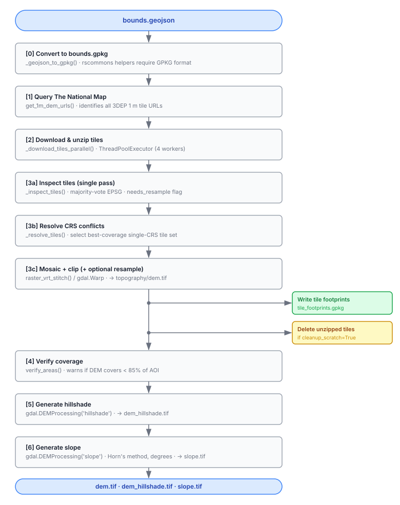

# `fetch_dem.py` — 3DEP DEM Fetching and Assembly

**Location:** `rscontextneo/src/fetch_dem.py`

---

## Overview

`fetch_dem.py` downloads, mosaics, and clips USGS 3DEP 1-metre DEM tiles for a given area of interest (AOI), then derives a hillshade and slope raster from the assembled DEM.  It is the sole topographic data-acquisition module for RS Context Neo and produces three output rasters:

| Raster | Relative path | Description |
|--------|--------------|-------------|
| DEM | `topography/dem.tif` | Elevation in metres, projected, compressed |
| Hillshade | `topography/dem_hillshade.tif` | Shaded relief of the DEM |
| Slope | `topography/slope.tif` | Terrain slope in degrees (Horn's method) |

A tile provenance record is also written to `topography/tile_footprints.gpkg`.

---

## Public Entry Point

### `fetch_dem_from_3dep(...) -> tuple[str, str, str]`

```python
fetch_dem_from_3dep(
    bounds_geojson: str,
    output_folder: str,
    download_folder: str,
    scratch_folder: str,
    output_res: float = 1.0,
    force_download: bool = False,
    cleanup_scratch: bool = True,
    download_workers: int = 4,
) -> tuple[str, str, str]   # (dem_path, hillshade_path, slope_path)
```

The function proceeds through six numbered stages described below.

---

## End-to-End Workflow



---

## Stage-by-Stage Detail

### Stage 0 — Bounds format conversion

rscommons helper functions (`verify_areas`, `find_rasters`) resolve vector paths through `get_shp_or_gpkg`, which forces the OGR GeoPackage driver.  GeoJSON is not accepted by that path.  The bounds GeoJSON (the native RS Context Neo project-bounds format) is therefore converted once to a single-layer GeoPackage (`scratch_folder/bounds.gpkg`) before any rscommons calls are made.

The layer is named **`bounds`** and the compound path `bounds.gpkg/bounds` is used as the `bounds_gpkg_layer` handle throughout the rest of the function.

> **Assumption:** The bounds GeoJSON is valid WGS84.  No reprojection is performed during this conversion.

---

### Stage 1 — Tile discovery

`rscommons.national_map.get_1m_dem_urls()` queries The National Map (TNM) REST API for all 3DEP 1-metre product tiles whose footprints intersect a small spatial buffer (`_BUFFER_DIST_DEG = 0.01°`) around the AOI.  The buffer ensures that tiles touching the AOI edge are captured.

**Returns:** a list of HTTPS URLs, each pointing to either a `.zip` archive (most tiles) or a bare `.tif` file.

> **Assumption:** 3DEP 1-metre coverage exists for the AOI.  If no tiles are found, the function raises `ValueError`.  Where 1 m coverage is unavailable, the caller should fall back to a different product (e.g. 10 m NED).

---

### Stage 2 — Parallel tile download and unzip

`_download_tiles_parallel()` uses a `ThreadPoolExecutor` (default 4 workers) to download tiles concurrently.

- `.zip` tiles: downloaded to `download_folder/ned/`, then unzipped to `scratch_folder/ned/<basename>/`.  The ZIP is kept as a persistent cache.
- Bare `.tif` tiles: downloaded directly to `download_folder/ned/`.

**Caching behaviour:**
- If a `.zip` already exists in `download_folder` and `force_download=False`, it is not re-downloaded; only unzipping is repeated if the unzip destination is missing.
- The in-progress sentinel file written by `rscommons.download.download_file()` makes concurrent workers (e.g. two projects sharing the same `download_folder`) safe against partial-write collisions.

> **Assumption:** All tiles are independent HTTPS downloads with no server-side session state.  Thread-based parallelism (not multiprocessing) is used because network I/O releases the GIL.

> **Assumption:** A failed tile download raises an exception and aborts the entire run rather than silently producing a partial DEM.

---

### Stage 3a — Single-pass tile inspection (`_inspect_tiles`)

Every tile file is opened exactly once to extract:

1. **CRS (EPSG code)** — read from the embedded WKT projection.  The majority EPSG is chosen by vote; ties are broken by taking the lowest code number.
2. **Resolution** — only the first successfully-opened tile is used.  All tiles within a single 3DEP product tier share the same pixel size, so sampling one tile is sufficient and avoids redundant I/O.

The **`needs_resample`** flag is set to `True` if the relative difference between the source resolution and `output_res` exceeds `_RESAMPLE_THRESHOLD = 10%`.

> **Assumption:** All tiles in a 3DEP 1 m product download have identical pixel sizes.  Averaging across all tiles (as the standalone `should_resample()` helper does) produces the same result and is not used in the main path.

> **Assumption:** `AutoIdentifyEPSG()` successfully identifies the EPSG for every valid 3DEP tile.  Tiles for which no EPSG can be parsed are excluded from the vote but not from the download list.

---

### Stage 3b — CRS conflict resolution (`_resolve_tiles`)

3DEP tiles are distributed in their native UTM zone.  An AOI that straddles a UTM zone boundary (e.g. straddles the boundary between Zone 11N and Zone 12N) will produce a mixed-CRS tile set.  `gdalbuildvrt` (used inside `raster_vrt_stitch`) silently drops every tile whose CRS does not match the first tile it encounters, which can result in a DEM that covers only part of the AOI.

`_resolve_tiles` addresses this with a two-step strategy:

#### Step 1 — fast path
If all downloaded tiles share the same CRS, return immediately.  This is the normal case for any AOI entirely within one UTM zone.

#### Step 2 — best-coverage CRS selection
If tiles span multiple CRSs:
1. Group tiles by EPSG code.
2. For each group, compute the fraction of the AOI that the group's tile footprints cover.  Coverage is computed in the tile's **native CRS** (not WGS84) because tile bounding boxes are perfect rectangles in their native CRS but become irregular quadrilaterals when projected to WGS84.
3. Select the group with the highest AOI coverage fraction.
4. **Discard all tiles from other CRS groups.**  No reprojection is performed.

If the winning group covers less than 100% of the AOI, a prominent warning is logged.  If coverage is below 85% the coverage verification in Stage 4 will also warn.

> **Design decision — no reprojection:** Reprojecting elevation data resamples pixel values and introduces interpolation artefacts.  For a topographic product these artefacts are unacceptable.  The trade-off is accepted: the DEM may have a data gap at UTM zone boundaries.  Users with AOIs that straddle zone boundaries should be aware of this limitation.

> **Assumption:** The AOI will almost always fall entirely within a single UTM zone.  Multi-zone AOIs are an edge case that produces a warning, not an error.

---

### Stage 3c — Mosaic, clip, and optional resample

`raster_vrt_stitch()` (from rscommons) builds a GDAL VRT from the tile list, clips to the AOI using `bounds_geojson` as a cutline (passed directly to `gdal.WarpOptions` — OGR auto-detection, **not** `get_shp_or_gpkg` — so GeoJSON works here), and writes the output DEM.

If `needs_resample` is `True`, bilinear resampling to `output_res` metres is added via `warp_options`.

GDAL creation options applied to the DEM:

| Option | Value | Purpose |
|--------|-------|---------|
| `COMPRESS` | `DEFLATE` | Lossless compression |
| `PREDICTOR` | `2` | Horizontal differencing — optimal for continuous data, ~50–70% size reduction |
| `TILED` | `YES` | Block-tiled layout for efficient partial reads |
| `BIGTIFF` | `IF_SAFER` | Use BigTIFF format automatically if the file would exceed 4 GB |

> **Assumption:** `raster_vrt_stitch` uses `bounds_geojson` only as a `cutlineDSName` value passed to `gdal.WarpOptions` which performs native OGR format detection.  This is why the mosaic step uses `bounds_geojson` directly while the rscommons helpers in other stages require the GPKG equivalent.

---

### Tile footprints GeoPackage

After mosaicing, `_write_tile_footprints_gpkg()` creates `topography/tile_footprints.gpkg` with one polygon feature per **originally downloaded tile** (i.e. before any CRS-based discards).  The layer is in WGS84 for immediate usability in any GIS.

Key attributes recorded per tile:

| Field | Description |
|-------|-------------|
| `filename` | Base filename of the downloaded tile |
| `original_epsg` | Native CRS EPSG code |
| `is_reprojected` | `1` if tile's CRS ≠ mosaic CRS (was a candidate for discard or reprojection) |
| `final_epsg` | EPSG of the assembled mosaic |
| `resolution_m` | Pixel size in metres |
| `file_size_mb` | Compressed tile size |
| `nodata_value` | Nodata sentinel (NULL if none set) |
| `x/y_min/max_native` | Bounding box in native CRS |

> **Note:** `is_reprojected = 1` means the tile's CRS differed from the mosaic CRS.  It does not confirm that the tile was actually reprojected — at present no reprojection is performed; such tiles are discarded.  The run log from `_resolve_tiles` records which tiles were discarded.

---

### Stage 4 — Coverage verification

`rscommons.download_dem.verify_areas()` computes the fraction of the AOI polygon area covered by valid (non-nodata) DEM pixels.  If coverage is below **85%**, a warning is logged.  This is not a hard failure — partial DEMs are valid outputs, but the warning alerts the user that 3DEP 1 m data may be incomplete for this region.

---

### Stage 5 — Hillshade

Generated with `gdal.DEMProcessing(... 'hillshade')`.

- If the output CRS is **geographic** (lat/lon), `gdal_dem_geographic()` is used instead, which applies a scale factor to account for the unit mismatch between horizontal degrees and vertical metres.
- If the output CRS is **projected** (UTM, the normal case), standard `gdal.DEMProcessing` is used directly.

> **Assumption:** 3DEP tiles are almost always in a UTM projected CRS, so the geographic branch is a rare fallback.

---

### Stage 6 — Slope

Generated with `gdal.DEMProcessing(... 'slope')` using Horn's method.  Output is in **degrees**.

**Why not the TauDEM D8 slope?**
- TauDEM's D8 slope is a dimensionless rise/run ratio along the single steepest flow-direction neighbour.  It is an internal hydrological routing intermediate, not a general terrain slope product.
- Horn's method uses all 8 neighbours and outputs degrees — this is the standard topographic slope product expected by BRAT, RME, and other downstream Riverscapes tools.

**Why no z-factor?**
- RS Context (geographic DEM) applies a haversine z-factor because horizontal units are degrees and vertical units are metres.
- Here the DEM is in a projected UTM CRS where **both** horizontal and vertical units are metres, so `scale=1.0` (the default) is correct.

**Input: raw `dem.tif`, not a hydrologically conditioned DEM.**
- Pit-filling or breach-conditioning raises depression cells, flattening those areas and misrepresenting true terrain slope.  The slope product must reflect actual topography.

---

## Idempotency and Caching

The function is designed to be re-entrant:

| Condition | Behaviour |
|-----------|-----------|
| All three outputs exist and `force_download=False` | Return immediately; nothing is downloaded or rebuilt |
| DEM exists but hillshade or slope is missing | Skips download and mosaic; rebuilds only the missing derived products |
| `force_download=True` | Re-downloads tiles and rebuilds everything |
| DEM exists but `needs_resample=True` | Rebuilds DEM (and derived products) at the new resolution |

The `download_folder` (ZIPs) is a persistent cache shared across projects.  The `scratch_folder` (unzipped tiles) is ephemeral and is deleted after mosaicing when `cleanup_scratch=True`.

---

## Key Assumptions Summary

| # | Assumption |
|---|------------|
| 1 | The bounds GeoJSON is valid WGS84. |
| 2 | 3DEP 1 m tiles exist for the AOI.  No automatic fallback to 10 m. |
| 3 | All tiles in a 3DEP 1 m download share the same pixel size. |
| 4 | `AutoIdentifyEPSG()` succeeds for all valid 3DEP tiles. |
| 5 | AOIs almost always fall within a single UTM zone.  Multi-zone AOIs produce a coverage warning and a potentially partial DEM. |
| 6 | No reprojection of elevation tiles is ever performed.  Discarding minority-CRS tiles is preferred over resampling artefacts. |
| 7 | The DEM is in a projected CRS (UTM).  The geographic hillshade/slope branch is a rare fallback. |
| 8 | Slope uses the raw DEM, not a hydrologically conditioned one. |
| 9 | A failed tile download aborts the entire run. |
| 10 | Coverage < 85% is a warning, not an error. |

---

## Helper Functions

| Function | Purpose |
|----------|---------|
| `_download_tiles_parallel` | Thread-pool download + unzip of all tiles |
| `_inspect_tiles` | Single-pass CRS vote + resample decision |
| `_resolve_tiles` | CRS conflict resolution for multi-zone AOIs |
| `_load_aoi_polygon_wgs84` | Parse AOI GeoJSON to a Shapely geometry |
| `_compute_tile_coverage` | Fraction of AOI covered by a CRS group's tiles |
| `_write_tile_footprints_gpkg` | Write provenance GeoPackage for all downloaded tiles |
| `_geojson_to_gpkg` | One-time format conversion for rscommons compatibility |
| `get_epsg` | Read EPSG code from a single raster |
| `get_best_crs` | Majority-vote EPSG across a raster list (standalone utility) |
| `is_geographic_epsg` | True if EPSG refers to a lat/lon CRS |
| `should_resample` | Standalone resample decision (not used in main path; `_inspect_tiles` is used instead) |

> **Note:** `get_best_crs` and `should_resample` are standalone utility functions adapted from `rscontext_3dep/dem_builder.py`.  They are not called in the main pipeline — `_inspect_tiles` performs both operations in a single pass to avoid opening every tile file twice.
